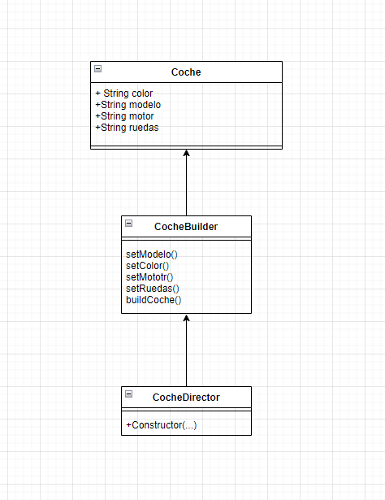

## PATRON BUILDER:

---


---

### PREGUNTAS EXAMEN:

* ¿Cual es la función del patrón builder? Pon ejemplo (que no sea Pizzas):
```
El patron builder es un patron de diseño que permite la construccion de objetos complejos paso a paso y separado de su representacion.
Esto facilita la construccion de objetos con distintas configuraciones sin tener que crear una clase separada para cada posible variación. 
En lugar de eso, el patrón Builder define un conjunto de pasos que se pueden utilizar para construir diferentes representaciones del objeto.
```
#####  EJEMPLO:
````
Un ejemplo aplicable al patron factory puede ser la fabricacion de un coche pues esta implica la utilizacion de muchas piezas distintas como pueden ser:
las llantas, el color, el modelo, el motor, etc. 
Si queremos fabricar varios coches con distintas configuraciones podemos utiizar el patron builder.

Este seria el codigo:

public class Coche {
    private String color;
    private String modelo;
    private String motor;
    private String ruedas;

    public Car(String color, String modelo, String motor, String ruedas) {
        this.color = color;
        this.model = modelo;
        this.engine = motor;
        this.wheels = ruedas;
    }

    // Métodos getters y setters para las propiedades de Coche
}

//Interfaz para la construccion de el coche que nos permitiría crear clases para distintos tipos de coches (deportivos, SUV, 4x4, etc.).
public class CocheBuilder {
    public void setColor(String color);
    public void setModelo(String modelo);
    public void setMotor(String motor);
    public void setRuedas(String ruedas);
    public Car buildCoche();
}

public class CocheDirector {
    private CocheBuilder builder;

    public CocheDirector(CocheBuilder builder) {
        this.builder = builder;
    }

    public void constructCoche(String color, String modelo, String motor, String ruedas) {
        builder.setColor(color);
        builder.setModelo(modelo);
        builder.setMotor(motor);
        builder.setRuedas(ruedas);
    }
}

public class Main {
    public static void main(String[] args) {
        CocheDirector director = new CocheDirector(builder);

        builder = new CocheFamiliarBuilder();
        director = new CocheDirector(builder);

        director.constructCoche("Azul", "Familiar", "Motor de 4 cilindros", "Llantas de acero");

        Coche familyCar = builder.buildCoche();
        System.out.println("Automóvil familiar construido: " + familyCar);
    }
}
````
#####  DIAGRAMA:


---
* ¿Podríamos combinarlo con el patrón Factory? Explícalo con algo de código como lo harías

````
Sí, es posible combinar el patrón Builder con el patrón Factory para crear objetos complejos de manera más eficiente. 
En este caso, el patrón Factory se encarga de crear diferentes variantes de objetos complejos, mientras que el patrón Builder se encarga de construir el objeto complejo en sí.


